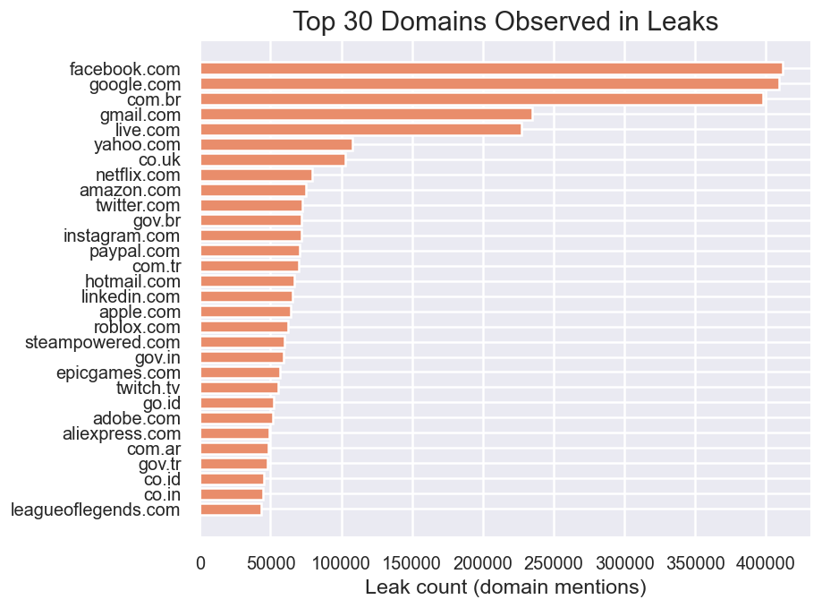
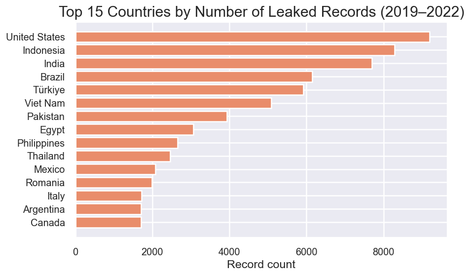

# A Data Pipeline & Analysis Project for Malware-Compromised Credential Data

It is a full data-ingestion and analysis workflow built to study a large dataset of compromised credentials collected from malware-infected systems.
The project focuses on building a reproducible ETL pipeline, loading the raw JSON dataset into a structured PostgreSQL database using Python, and preparing the cleaned data for Tableau and Power BI visualization.

This repository contains:

- A PostgreSQL schema tailored for the dataset
- A Python ingestion pipeline that imports hundreds of thousands of JSON files safely
- Automatic file-processing tracking to avoid duplicates
- Scripts for validating table creation and database health
- Data-cleaning steps
- Instructions for exporting final data for Tableau & Power BI dashboards

## Dataset Source & Attribution

All raw JSON data used in this project comes from the paper:

Malware Finances and Operations: a Data-Driven Study of the Value Chain for Infections and Compromised Access

Creators:

- Juha Nurmi
- Mikko Niemelä
- Billy Brumley

Dataset URL: https://zenodo.org/records/8047205

This dataset is not created or owned by this project.
All rights belong to the authors.
This repository only contains scripts for local parsing and analysis.

## Purpose

The project explores how credential-stealing malware extracts sensitive information from infected machines.
After cleaning and loading the raw JSON files, the pipeline enables analysis of:
- stored passwords
- domain names & services accessed
- email addresses & usernames
- IP address metadata
- weak-password patterns
- ecosystem exposure (Google, Meta, Microsoft)
- country-level behavior

Tableau / Power BI dashboards can then be built over the cleaned dataset to reveal:
- regional exposure patterns
- password habits
- high-frequency service domains
- relationships between services and user behavior

## Example Visual Insights

### Top 30 Domains Observed in Leaks

### Top 15 Countries by Number of Leaked Records (2019–2022)

